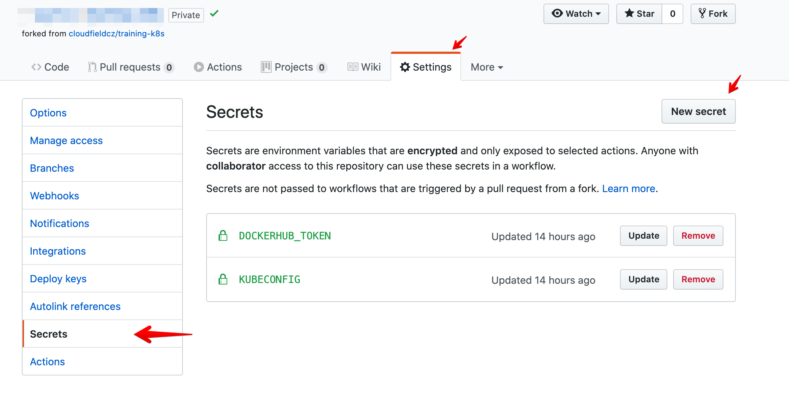
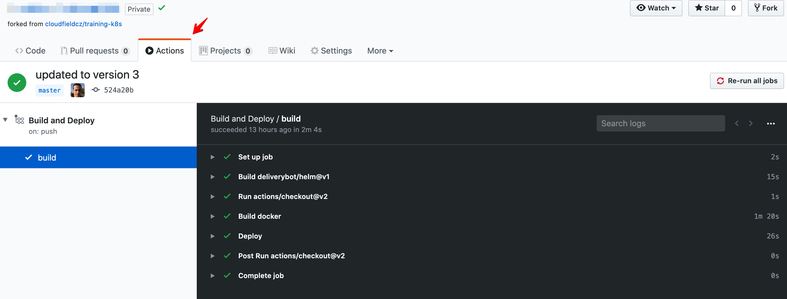

# CI/CD

```bash
# goto directory for this lab
cd ../module05
```

## Prepare to CI/CD with helm.

Helm is template engine (deployment engine) for kubernetes.

Please change IP address of your ingress controller and name of your Azure Container Registry in `helm upgrade` command below.

```bash
# variables
. ../rc

# create namespace
kubectl create namespace myapp

# create secrets
POSTGRESQL_URL="jdbc:postgresql://${POSTGRESQL_NAME}.postgres.database.azure.com:5432/todo?user=${POSTGRESQL_USER}@${POSTGRESQL_NAME}&password=${POSTGRESQL_PASSWORD}&ssl=true"
kubectl create secret generic myrelease-myapp \
  --from-literal=postgresqlurl="$POSTGRESQL_URL" \
  --namespace myapp

# Get ingress public IP
export INGRESS_IP=$(kubectl get service nginx-ingress-ingress-nginx-controller  -n nginx-ingress -o jsonpath='{.status.loadBalancer.ingress[0].ip}')
echo "You will be able to access application on this URL: http://${INGRESS_IP}.xip.io"

# deploy from ACR helm repository
helm upgrade --install myrelease helm/myapp --namespace='myapp' --set-string appspa.image.repository="${ACR_NAME}.azurecr.io/myappspa",appspa.image.tag='v1',apptodo.image.repository="${ACR_NAME}.azurecr.io/myapptodo",apptodo.image.tag='v1',apphost="${INGRESS_IP}.xip.io"

# clean-up deployment
helm --namespace myapp delete myrelease
# delete namespace
kubectl delete namespace myapp
```

## Deployment to Kubernetes using GitHub Actions
This CI/CD demo contains simple GitHub pipeline using GitHub Actions. The pipeline automatically builds and deploys changes in the master branch to the Kubernetes cluster (AKS).

### Creating GitHub pipeline file
```bash
# Copy .github folder to the repository root path
cp -r ./module05/.github .github
# Replace variables in the GitHub pipeline 
sed -i '' 's/YOURACRNAME/'$ACR_NAME'/g' .github/workflows/*.yml
sed -i '' 's/INGRESSIP/'$INGRESS_IP'/g' .github/workflows/*.yml
```

### Creating Secrets on GitHub (in the repository Settings)


1) The DOCKERHUB_TOKEN secret

Insert value from the following command:
```bash
az acr credential show --name $ACR_NAME --resource-group $RESOURCE_GROUP --query "passwords[0].value" --output tsv
```
2) The KUBECONFIG secret

Insert the content of the cluster config file (see the parameter --file, you can change it as you wish):
```bash
az aks get-credentials --admin --name ${AKS_CLUSTER_NAME} --resource-group ${RESOURCE_GROUP} --file /tmp/${AKS_CLUSTER_NAME}
```

### Running pipeline
When you commit your .github folder to your forked repo, the GitHub will run the Action. The Action log could be found on the repository page:

The Action will be fired on all changes in your repository, so all changes in the master branch will be automatically deployed.

## CI/CD based on GitHub + Azure Container Registry build

This CI/CD demo contains CI simple pipeline in Azure Container Registry and CD pipeline in FLUX (git based delivery system - https://github.com/weaveworks/flux ).

### ACR based CI pipeline

There we will define two build tasks - for building SPA web GUI and TODO microservice.

```bash
# set default ACR name
az configure --defaults acr=${ACR_NAME}
# build manualy / last parameter of command is your forked github repo
az acr run -f module05/acr/myapp-ci.yaml https://github.com/valda-z/k8s-workshop-developer.git
```

Now let's prepare task triggered by github commit. We will need access token for this task, there is description: https://help.github.com/articles/creating-a-personal-access-token-for-the-command-line/ .

```bash
# now prepare task triggered by github commit
az acr task create -n myapp -f module05/acr-flux/myapp-ci.yaml \
  -c https://github.com/valda-z/k8s-workshop-developer.git \
  --pull-request-trigger-enabled true \
  --git-access-token 0000000000000000000000000000000000000000

# list tasks
az acr task list -o table

# list run history
az acr task list-runs -o table
```

Now we can create small commit in our repo and check via `az acr task list-runs -o table` if build was triggered and status of build.

## CI/CD in Jenkins (AKS + ACR)

How it works?

Jenkis is deployed directly to AKS cluster, master jenkins container exposes user interface on public IP address on port 8080. Jenkins build agents are deployed ad-hoc when build job needs agent and is destroyed just after build.

Build pipeline is in Jenkinsfile which is part of source code tree in github. Build pipeline consists these steps:

* clone source codes from git
* build docker images (and applications)
* push images to Azure Container Registry
* deploy new version via helm to AKS cluster

```bash
# install jenkins (from repository k8s-workshop-developer, directory module05)
cd module05

# Get ingress Public IP
export INGRESS_IP=$(kubectl get svc ingress-nginx-ingress-controller -o=custom-columns=EXTERNAL-IP:.status.loadBalancer.ingress[*].ip | grep -v "EXTERNAL-IP")

# postgres URL
POSTGRESQL_URL="jdbc:postgresql://${POSTGRESQL_NAME}.postgres.database.azure.com:5432/todo?user=${POSTGRESQL_USER}@${POSTGRESQL_NAME}&password=${POSTGRESQL_PASSWORD}&ssl=true"

# install jenkins - please put your github repository name to --giturl parameter
./jenkins/deploy.sh \
  --ingressdns "${INGRESS_IP}.xip.io" \
  --postgresjdbcurl "${POSTGRESQL_URL}" \
  --acrname "${ACR_NAME}" \
  --acrkey "${ACR_KEY}" \
  --giturl "https://github.com/azurecz/k8s-workshop-developer.git"
```

## CI/CD in Azure DevOps
### Prerequisities
You have to have microsoft account or MSDN license

Open browser on https://dev.azure.com

```text
   1. Create a project
   2 Import a repo from github for simplicity we use only master branch
   3 Create service connection for ACR and AKS
   4 Create variable group (Library) and needed variables
   5 You have to link variables to concrete pipeline --> edit --> variables --> variable groups
   6 Create a build pipeline
```

```yaml
trigger:
- master

#runinng on MS hosted images
pool:
  vmImage: 'Ubuntu-16.04'

# available variables from Global
# KeyVault secrets must be linked
variables:
- group: BaseVariables

steps:

- bash: |
   echo $(acr-name-demo)
   # myapptodo
   cd module01/src/myapptodo
   docker build -t $(acr-name-demo)/myapptodo:latest . # should be tagged $(Build.BuildId) or ReleaseId
   docker login -u $(acr-name-demo-user) -p $(acr-psw) $(acr-name-demo)
   docker push $(acr-name-demo)/myapptodo:latest 
   # myappspa
   cd module01/src/myappspa
   docker build -t $(acr-name-demo)/myappspa:latest . # $(Build.BuildId)
   docker push $(acr-name-demo)/myappspa:latest
  displayName: 'Build, tag and push image'

- task: CopyFiles@2
  inputs:
    sourceFolder: '$(Build.SourcesDirectory)/module05/helm'
    #contents: '**' 
    targetFolder: '$(Build.ArtifactStagingDirectory)'
    #cleanTargetFolder: false # Optional
    overWrite: true
    #flattenFolders: false # Optional

- task: PublishBuildArtifacts@1
  inputs:
     pathtoPublish: '$(Build.ArtifactStagingDirectory)' 
     artifactName: 'drop' 

```

### Create a release pipeline

```text
   1 Create a stage (currently only Deploy)
   2 Choose Deploy app to AKS via its Helm chart
   3 Install helm (2.12.2)
   4 helm init with arg --service-account tiller --upgrade
   5 helm deploy (set chart path and --install param)
```

### For enthusiasts
### alternative sample (not tested)
```yaml
 - task: Docker@1
   displayName: Build image
   inputs:
     command: build
     azureSubscriptionEndpoint: $(azureSubscriptionEndpoint)
     azureContainerRegistry: $(azureContainerRegistry)
     dockerFile: Dockerfile
     imageName: $(Build.Repository.Name)

 - task: Docker@1
   displayName: Tag image
   inputs:
     command: tag
     azureSubscriptionEndpoint: $(azureSubscriptionEndpoint)
     azureContainerRegistry: $(azureContainerRegistry)
     imageName: $(azureContainerRegistry)/$(Build.Repository.Name):latest
     arguments: $(azureContainerRegistry)/$(Build.Repository.Name):$(Build.BuildId)

 - task: Docker@1
   displayName: Push image
   inputs:
     command: push
     azureSubscriptionEndpoint: $(azureSubscriptionEndpoint)
     azureContainerRegistry: $(azureContainerRegistry)
     imageName: $(Build.Repository.Name):$(Build.BuildId)
```
